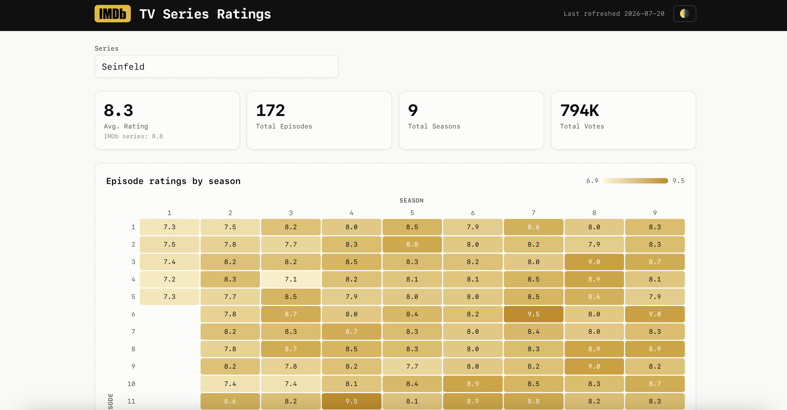

# TV Series Ratings Dashboard

An interactive dashboard of IMDb episode ratings for a curated set of TV shows —
a season × episode heatmap, headline stats, an all-episodes table, and an average
rating-by-season chart. A modern, buildless successor to an earlier Tableau
dashboard and R/Shiny tool.

🔗 **Live:** https://steodose.github.io/imdb/



## How it works

The project has two halves: a small Python **data pipeline** that turns the official
IMDb datasets into compact JSON, and a **static frontend** that reads that JSON. There
is no framework and no build step.

### Data

Ratings come from the official [IMDb datasets](https://datasets.imdbws.com/)
(`title.episode`, `title.ratings`, `title.basics`), which IMDb refreshes daily.
`scripts/build_data.py` (Python standard library only) downloads those files, joins
each episode to its rating and title for every show listed in `data/series_urls.csv`,
and writes one JSON file per show plus an `index.json` catalog into `data/series/`.
Headline numbers are aggregated across episodes (average rating, summed votes), and
each file is stamped with the date it was built.

### Frontend

`index.html`, `app.js`, and `styles.css` are the entire app — plain HTML and vanilla
JavaScript with Tailwind loaded from a CDN. On load it reads the prebuilt JSON and
renders the heatmap, KPI tiles, episode table, and season chart, with a searchable
show picker, light/dark theming, and deep-linkable URLs (e.g. `?show=tt0903747`).
Because it is fully static, it is served straight from GitHub Pages.

### Staying current

A scheduled GitHub Action (`.github/workflows/refresh-data.yml`) rebuilds the data
each week from the latest IMDb datasets and commits it back only when something
changed, so the published site keeps itself up to date. The curated lineup lives in
`data/series_urls.csv` — one `Series Name,ttXXXXXXX` row per show, where the `tt…` id
comes from the show's IMDb URL.

## Project layout

```
index.html            dashboard shell
app.js                loads JSON, renders heatmap / tiles / table / chart
styles.css            theme tokens + heatmap / chart styles
data/
  series_urls.csv     curated show list — "Name,ttXXXXXXX" per row
  series/             generated JSON: index.json + one <imdbId>.json per show
scripts/build_data.py the data pipeline (stdlib only)
.github/workflows/    weekly data-refresh automation
downloads/            raw IMDb .tsv.gz (gitignored)
```

## Data & credits

IMDb data is used under IMDb's [dataset terms](https://www.imdb.com/interfaces/) for
personal, non-commercial use. A *Between the Pipes* project by
[Stephan Teodosescu](https://stephanteodosescu.com).
